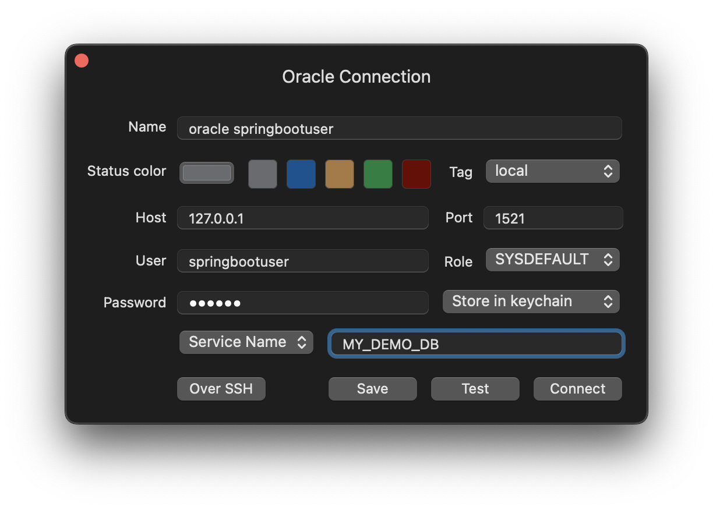
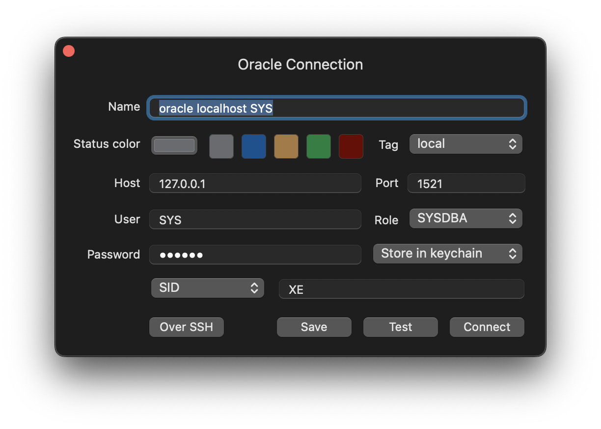

# Spring Boot Application with Oracle Database

## Docker Compose Setup

To run the oracle database locally in a Mac M1 chip, follow these instructions, if you don't have an M1 / M2 chip proceed to number 3.

1. Install `colima` via homebrew if you haven't installed it yet:

   ```shell
   brew install colima
   ```

2. Start `colima`:

   ```shell
   colima start
   ```

   * NOTE: If you want to switch to the normal Docker instance:

   ```shell
   colima stop
   ```

3. With `colima` running (only needed for M1 / M2 chips), we can now create our `docker-compose.yml` environment:

   First we create a `.env` file copying the content of `.env.example`. Then we execute in the root folder:

   ```shell
   docker compose up -d
   ```

## Configure Oracle DB

Once you've spun up your local `docker-compose-yml` environment it is time to configure the Oracle DB (in this case it is `express:21.3.0-xe`).

1. Connect as the `SYS` user to create a _new application user_ and _database_, this _new user_ will be the one used by the SpringBoot Application to connect.

   ```shell
   docker exec -i ods-oracle sqlplus sys/secret@localhost as sysdba
   ```

   * NOTE: `ods-oracle` is the name of the docker container which was named inside `docker-compose.yml`, i.e.:
   ```
   container_name: ods-oracle
   ```

   Inside `sqlplus` execute the following, (you should adjust the values of username (`springbootuser`),
    password (`secret`), file name (`/my_demo_db/`) and database name (`MY_DEMO_DB`) as needed:

   ```shell
   create pluggable database MY_DEMO_DB
   admin user springbootuser identified by secret
   file_name_convert = ('/pdbseed/', '/my_demo_db/');

   alter pluggable database MY_DEMO_DB open;
   ```

2. Once those commands have executed correctly, you have to connect to the new _database_ created as `SYS` to grant privileges to the _recently created user_.

   ```shell
   docker exec -i ods-oracle sqlplus sys/secret@localhost/MY_DEMO_DB as sysdba
   ```

   Then, inside `sqlplus` execute:

   ```shell
   grant all privileges to springbootuser;
   ```

3. Now that we have our user with the needed permissions, we can run the SpringBoot application:

   ```shell
   ./gradlew bootRun
   ```

   The Flyway migrations should run successfully.

# Connections in GUI clients

You can create a connection inside GUI clients (i.e. TablePlus) like this:

- For the application user (`springbootuser`):


- For the `SYS` user, although this one isn't really needed:


Now you are ready to code 👍